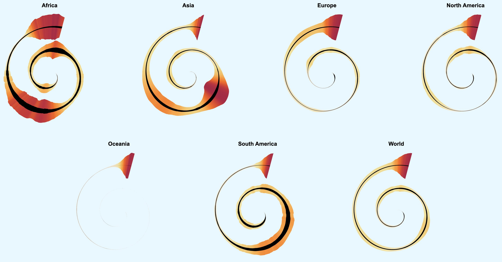

# covid-spiral

Small study to see how one can code a spiral-shaped data visualization of covid-19 cases and deaths.

Inspired by the [New York Times](https://www.nytimes.com/2022/01/06/opinion/omicron-covid-us.html).



Spiral: Time (top: January, then clockwise through the months)

Colored area: 7-day average of new cases per one million population

Black area: 7-day average of new deaths per one million population **x 10**

Data source: Our world in data


## Run the viz locally

Install [npm](https://www.npmjs.com/get-npm).

```
git clone https://github.com/higsch/covid-spiral.git
cd covid-spiral

npm install

npm run dev
```

Open your browser at `localhost:8080`.


## Created with

HTML, CSS, JavaScript, Svelte, D3


## Created by

Matthias Stahl, 2022
